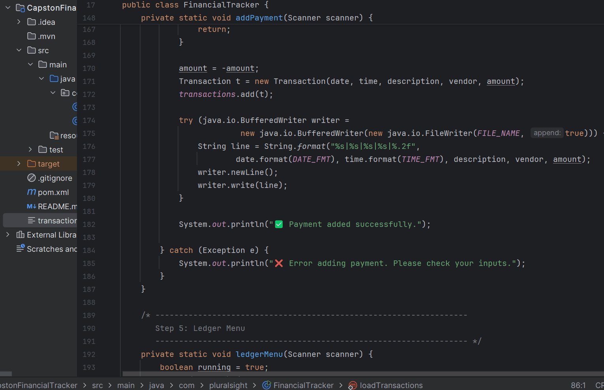

# MyFinancial Ledger

## Description of the Project

MyFinancial Ledger: 
A Java Console App for Tracking Deposits and Payments
## User Stories

- As a user, I want to **add deposits and payments** so that I can track my financial transactions in one place.
- As a user, I want to **view a ledger of all transactions** so that I can easily review my spending and income history.
- As a user, I want to **filter transactions by deposits or payments** so that I can focus on specific categories.
- As a user, I want to **see the date, time, description, and vendor** of each transaction so that the records are detailed and clear.
- As a user, I want to **save my data to a CSV file** so that my transaction history is stored safely and accessible even after closing the program.

## Setup
Open in IntelliJ IDEA->Check Java SDK 17->File location is Capstone in our pluralsight folder

### Prerequisites

- IntelliJ IDEA: Ensure you have IntelliJ IDEA installed, which you can download from [here](https://www.jetbrains.com/idea/download/).
- Java SDK: Make sure Java SDK is installed and configured in IntelliJ.

### Running the Application in IntelliJ

Follow these steps to get your application running within IntelliJ IDEA:

1. Open IntelliJ IDEA.
2. Select "Open" and navigate to the directory where you cloned or downloaded the project.
3. After the project opens, wait for IntelliJ to index the files and set up the project.
4. Find the main class with the `public static void main(String[] args)` method.
5. Right-click on the file and select 'Run 'YourMainClassName.main()'' to start the application.

## Technologies Used

- Java: Mention the version you are using.
- Displaying data in tables (console formatting) mainly google.

## Demo

## Future Work

Outline potential future enhancements or functionalities you might consider adding:

- Additional feature to be developed.
- Improvement of current functionalities.

## Resources

List resources such as tutorials, articles, or documentation that helped you during the project.

- [Java Programming Tutorial](https://www.example.com)
- [Effective Java](https://www.example.com)

## Team Members

- **Name 1** - Specific contributions or roles.
- **Name 2** - Specific contributions or roles.

## Thanks

Express gratitude towards those who provided help, guidance, or resources:

- Thank you to [Mentor's Name] for continuous support and guidance.
- A special thanks to all teammates for their dedication and teamwork.
